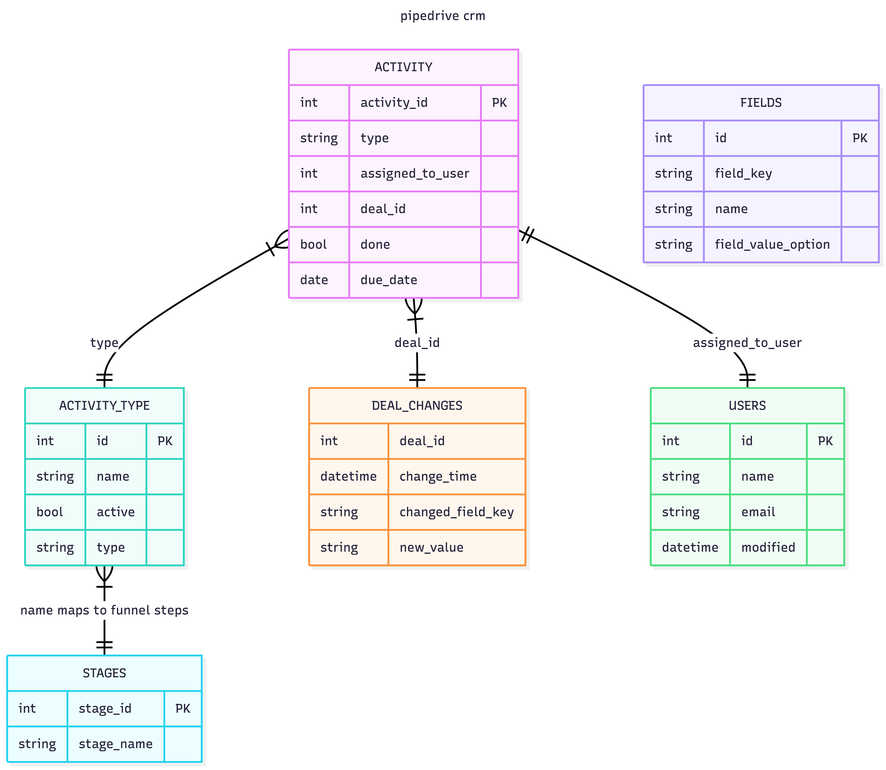
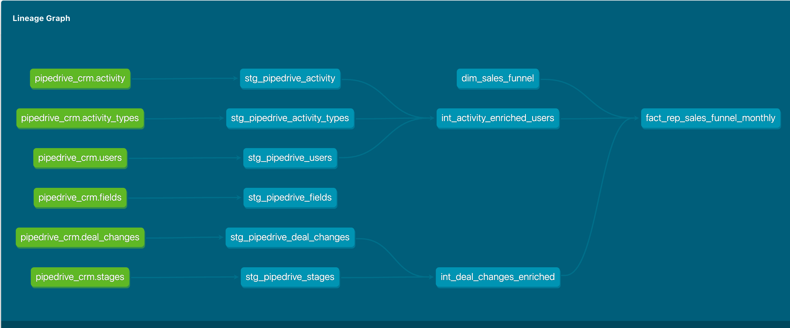

## overview
This repo demonstrates a production level dbt modelling style and delivers  the model layers, test, access, 
CI/CD for the crm pipedrive data.

### After exoloratory analysis, this entity relationship diagram is created using mermaid(text-based diagramming tool)
to proceed with modeling steps
   source: https://www.mermaidchart.com/app/dashboard
   
  - Model layers:
    - staging -> raw data from source with minimal changes
    - intermediate -> join staging table to follow the business goal
    - mart -> final dim.fact layer for the aggregation for reporting and dashboards
    - access view -> stakeholder facing views to deal with access
  - PII handling:
    - There are user's personal data in users table(name, email) , so while taking it in our staging layer, we have hashed it using md5 for now
    - but, for more strong level masking/hashing we can use sha256
  - Model Tests:
    - Each layer ahs its own set of tests used mostly from inhouse dbt_utils
  - Model documentation:
    - every layer has its yml file that has description about model, columns, some basic tests to ensure data correctness and integrity
    - data contract is also added to follow data governance norms and policies set by the team and its stakeholders like slas,
      business owner, freshness etc and can be extended.
  - Macros
    - Macros created to deal with automatic schema generation to avoid manual creation and increase reusability in diff environments
    - Macros created to map the funnel step and kpi to avoid manual mapping in model files. This will decrease possibility of typos, frequent changes
      in model files and becomes a central place to do the recurrring changes and avoid change in model itself
  - profile:
    - if there are database credentials needs to be sued in profiles.yml then its recommended to use github secrets
    - for local run create a local profile yml that will be in your machine and not exposed to outside world to keep
      the sensitive credentials safe
  - dbt_project.yml:
    - create a dbt standard project yaml and add additional parameter if there are any vars to be used in models etc.
  - packages:
    - dbt has inbuilt few packages that can be used like dbt_utils, codegen
    - add the version
    - do dbt deps and you are ready to use it
  - requirements.txt: 
    - add dbt and its adaptar version for the installation
    - dbt-core==1.9.1
    - dbt-postgres==1.9.1
  - CI/CD:
    - add workflow files like deploy.yaml, dev_workflow yaml etc. in .github/workflows file 
    - here, we have added workflow files but assuming its a fork repo and lacks some permission from its parent repo
      to read secrets from parent repo. Hence, getting run is getting failed, but this is how we can setup our giyhub actions to:
      - dry run code once PR is raised
      - test dbt code coverage and test on PR
      - build and deploy docker image to destination registry (like artefact in case we sue gcp)
        - if its dev env on PR raise, the image will be deployed ind ev env with img tag: latest
      - check sql structure and format using pre commit
      - once PR is reviewed and approved, the master workflow will merge the PR to main/master branch in no conflict is found
        and all CI steps are passed 
        - push image to prod registry and create semantic release
    This is what a complete cycle looks like.
    
## How to run locally
   - Fork the original repo and add these files
   - configure your profile.yml with your postgres credentials
   - install dbt-core and postgres adaptar
   - dbt debug(if everything is fine with setup)
   ### Run a single model
    ```dbt run --select int_activity_enriched_users --taregt:dev```
   ### Run all models with a tag
     ```dbt run --select 'tag:stg' --target:dev```
   ### Generate and serve docs locally
    ```dbt docs generate```
    ```dbt docs serve```
This is how the dbt lineage will look like on dbt docs

